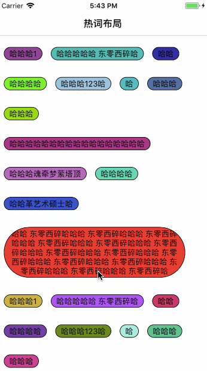

# ZZHotKeysMenu
ZZHotKeysMenu 自定义布局，继承自 UICollectionViewLayout

### 关键词：
布局，集合视图，视图效果，UICollectionView

### 功能
行，列间距，边距皆 可自定义设置

运行效果如下,可参考Demo：


### 使用
1. 设置边距等相应参数

```objc
- (UICollectionView *)hotKeyCollectView{
    if (_hotKeyCollectView == nil) {
        UICollectionView *  collectionView = [[UICollectionView alloc]initWithFrame:self.view.bounds collectionViewLayout:self.hkLayout];
        collectionView.backgroundColor = [UIColor whiteColor];
        collectionView.delegate=self;
        collectionView.dataSource =self;
        [self.view addSubview:collectionView];
        [collectionView registerClass:[ZZCollectionViewCell class] forCellWithReuseIdentifier:kCellID];
        _hotKeyCollectView = collectionView;
    }
    return _hotKeyCollectView;
}

- (ZZHotKeysLayout *)hkLayout{
    if (_hkLayout == nil) {
        _hkLayout = [[ZZHotKeysLayout alloc]init];
        _hkLayout.flowEdgeInset = UIEdgeInsetsMake(20, 10, 15, 40);
        _hkLayout.rowSpace = 30;
        _hkLayout.columSpace = 15;
        _hkLayout.delegate = self;
    }
    return _hkLayout;
}

```

2. 实现相应代理方法

```objc
- (CGSize)hotKeysLayout:(ZZHotKeysLayout *)layout indexPath:(NSIndexPath*)indexPath;
```


如有问题或建议，欢迎批评指正：
[简书地址联系](http://www.jianshu.com/u/6f333144f665)